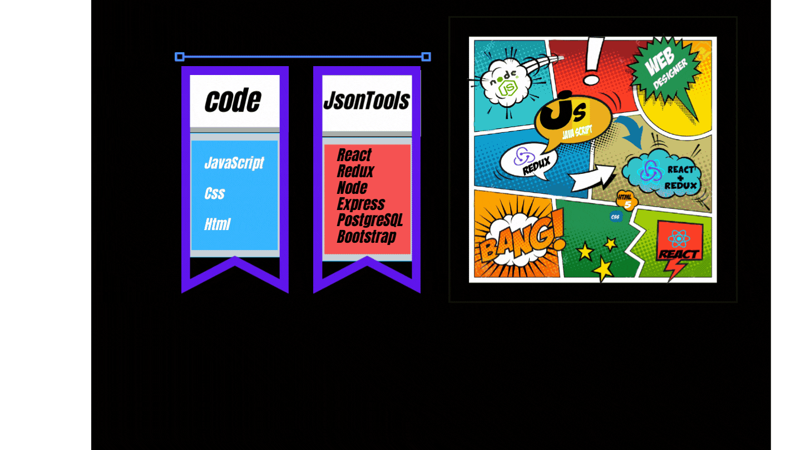

```JavaScript
console.log("Hello World");
```


 
 
## Code Snippet
---
```JavaScript

const Ricardo ={
id: 1,
name: "Ricardo",
lastname: "Ramirez",
age: "22",
email: "SH_Ricardo@hotmail.com",
city: "Buenos Aires",
country: "Argentina",
code: [Javascript, Css, Html],
tools: [React, Redux, Node, Express, PostgreSQL, Git, Bootstrap],
description:
"I am a Full-Stack web developer passionate about technologies I love learning and meeting new challenges",
};
return (

<

````
---




---
## About Me
<p>

I am a Full-Stack web developer passionate
<br/>
 about technologies.
I love learning and meeting new
challenges
</p>


``` JavaScript
console.log("Bye World");
````
